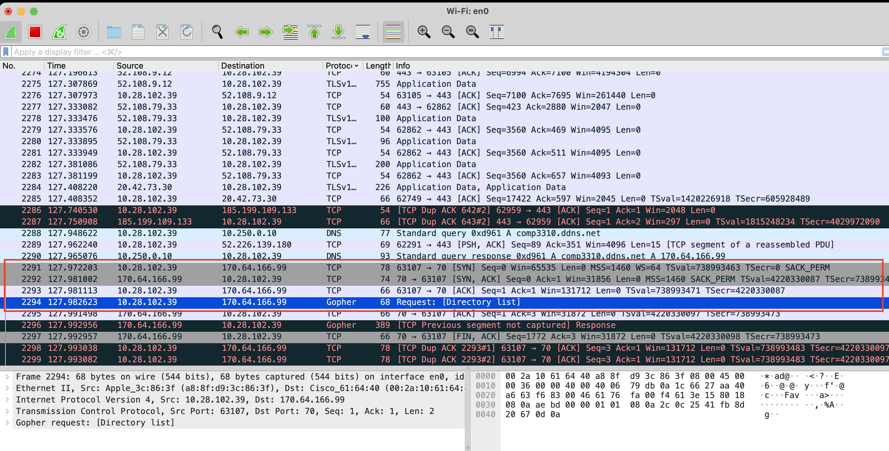

# COMP3310 A2 Gopher Indexer Project

*Jeremiah Xing (u7439274)*

The Gopher Indexer is a Java application designed to fetch and index files from Gopher servers. It efficiently manages connections, handles both text and binary data, and logs detailed operational statistics.

## WireShark Screenshot & Summary for the Initial Response:

We can first use `telnet` to inspect the destination of the Gopher server `comp3310.ddns.net:70`:

```bash
telnet comp3310.ddns.net 70
```

From the output, we can see server ip is: `170.64.166.99`.

Then we can use `WireShark` to capture the packets during the connection. The screenshot is shown below (red box):



### Packet Breakdown
#### Packet 2291
- Timestamp: 127.972203 seconds since capture start. 
- Source IP: 10.28.102.39 (client)
- Destination IP: 170.64.166.99 (server)
- Protocol: TCP 
- Details: This packet initiates a connection to the server with the TCP SYN flag set, indicating the start of a TCP handshake. The sequence number is 0. The client proposes a window size of 65535 and other TCP options like maximum segment size (MSS) of 1460, window scaling factor (WS) of 64, timestamp value, and selective acknowledgment permitted (SACK_PERM).
#### Packet 2292
- Timestamp: 127.981002 seconds.
- Source IP: 170.64.166.99 (server)
- Destination IP: 10.28.102.39 (client)
- Protocol: TCP
- Details: The server responds with TCP SYN, ACK flags, acknowledging the client's SYN (Ack=1). The sequence number is 0, starting its own sequence count. The server proposes a window size of 31856 and sets its MSS to 1460, with a WS of 128, along with similar TCP options as the client.
#### Packet 2293
- Timestamp: 127.981113 seconds.
- Source IP: 10.28.102.39 (client)
- Destination IP: 170.64.166.99 (server)
- Protocol: TCP
- Details: The client acknowledges the server's SYN, ACK with an ACK packet, completing the TCP three-way handshake. This packet has no data payload, indicating it's merely an acknowledgment with Seq=1 and Ack=1, where Seq=1 is the next expected byte from the client.
#### Packet 2294
- Timestamp: 127.982623 seconds.
- Source IP: 10.28.102.39 (client)
- Destination IP: 170.64.166.99 (server)
- Protocol: Gopher
- Details: The client sends a Gopher request after the handshake is completed. The request is for a directory listing. Gopher is a protocol designed to distribute, search, and retrieve documents over the Internet.
### Analysis of the Communication
Establishment of TCP Connection: The packets describe a typical TCP three-way handshake which is essential for establishing a reliable connection between two hosts. This ensures that both the client and the server are ready to send and receive data, providing a reliable connection-oriented service.

Gopher Protocol Use: After the TCP connection is established, the client begins communication using the Gopher protocol, indicated by the Gopher request for a directory listing. Gopher is a less common protocol today, typically used in specific, often academic or legacy contexts. This indicates a specific use case or a possibly older system still in operation.

## Requirements

- Java JDK 21 or higher
- Gradle 8.6 or higher

**_NOTE:_** If you already installed the correct version of Gradle. Run `gradle build` might automatically download the required JDK if it is missing. However, if it doesn't work, you can download and install the JDK manually. 

If you open this project via IDEs like [IntelliJ IDEA](https://www.jetbrains.com/idea/), it will prompt you to download the JDK if it is missing. General guides of how to install Gradle and JDK are also provided below:

- How to install Gradle: [Gradle Installation Guide](https://gradle.org/install/)
- How to install JDK: [OpenJDK JDK 21.0.2 General-Availability Release](https://jdk.java.net/21/)

### **_NOTE:_** An Easy Take-Off for Marking Tutors:

If you are the tutor who is marking this assignment and want to save some time, after config the required environment below, under the project root directory, you can simply:

```bash
gradle build
gradle run
```

Then you can see the output in the console. 

If you want to save the output to a file, you can run:

```bash
gradle build
gradle run > output.log
cat output.log
```

The output will be saved in the `output.log` file.

## Build

Under the project root directory, run the following commands to build the application via Gradle:

```bash
gradle build
```

## Run

After building the application, you can simply run the application using the following command:

```bash
gradle run
```

This will connect to the default Gopher server `comp3310.ddns.net:70`, and index the files on it. The application will then print the indexed files and statistics to the console.

You can also save the output to a file by running the following command:

```bash
gradle run > output.log
```

You can check the output in the `output.log` file with better rendering in console via:

```bash
cat output.log
```


## Usage

The application is a command-line tool that accepts the following arguments:

```bash
gradle run [-PappArgs="['<hostname>', '<port number>']"]
```

- `<hostname>`: the hostname of the Gopher server to connect to
- `<port number>`: the port number of the Gopher server to connect to
- If no arguments are provided, the application will connect to the default Gopher server `comp3310.ddns.net` on port `70`.

Example of running the application with arguments:

```bash
gradle run -PappArgs="['gopher.floodgap.com', '70']"
```


## Implementation

- The application is implemented in Java using `Socket()` API in the `java.net` package for network operations. 
- The application only handle 4 kinds of Gopher items as required in the assignment: text files (type 0), directories (type 1), binary files (type 9), and error messages (type 3). Other types of items are ignored.
- The `ConnectionHandler` class is used to manage the socket connection. 
  - It has applied a timeout for each connection and response-read. 
  - 2 retries are allowed if the connection fails. Exponential backoff is used to increase the waiting time between retries. 
  - The size of the response are also limited to 1MB in case of edge case large response.
- The `GopherIndexer` class is the main class that manages the connection to the Gopher server, fetches and indexes files, and logs statistics.
- The `Logger` class is used to customize logging messages and statistics. It uses ANSI escape codes to colorize the output for better readability. There are 3 types of log levels: `INFO`, `WARNING`, and `SEVERE`.
  - `INFO`: normal information messages, ANSI color code: green
  - `WARNING`: warning messages, ANSI color code: yellow
  - `SEVERE`: severe error messages, ANSI color code: red
- The successfully fetched files can be found in the `download_files` directory under the project root directory after running the application. The file name might be changed for a safe file-save operation.

## Output

- The application will output the log while it indexing;
- The statistics will be printed at the end of the indexing process. The statistics include:
  - Total Directories on the Server: 
    - Displays the count of directories identified on the server, including the root directory. Some directories may be unreachably stored on the server, not all directories are fetched, and the count includes those marked with a data type '1' which represents directories on the server and the server root directories itself. 
  - List of Directories: 
    - If there are any directories found, a list of all directory paths on the server is printed. 
  - Total Text Files: 
    - The number of text files successfully fetched from the server is displayed. 
  - List of Text Files: 
    - If text files are found, their paths are listed. 
  - Total Bad Text Files: 
    - Indicates the number of text files that were fetched unsuccessfully. 
  - List of Bad Text Files: 
    - Lists the paths of text files that were fetched unsuccessfully. 
  - Total Binary Files: 
    - Displays the count of binary files that were successfully fetched. 
  - List of Binary Files: 
    - Lists the paths of successfully fetched binary files. 
  - Total Bad Binary Files: 
    - Indicates the number of binary files that were fetched but were either empty or received a null response. 
  - List of Bad Binary Files: 
    - Lists the paths of binary files that were empty or had a null response. 
  - File Size Statistics: 
    - Reports the content of the smallest text file, 
    - the size of the largest text file in bytes, 
    - the size of the smallest binary file in bytes, 
    - and the size of the largest binary file in bytes. 
  - External Servers: 
    - Counts and lists external servers that are up and those that are down. 
  - Unique Invalid References: 
    - Displays the number of unique invalid references encountered (type 3) and lists them.
  - Error Statistics: 
    - Displays the number of errors encountered during the indexing process.


## Documentation

The source code is documented using Javadoc comments. You can generate the Javadoc documentation by running the following command:

```bash
gradle javadoc
```

The generated documentation can be found in the `build/docs/javadoc` directory. You can open the `index.html` file in a web browser to view the documentation.
